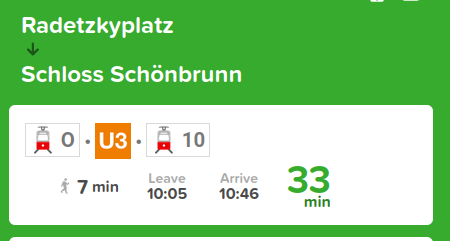
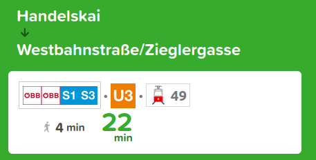
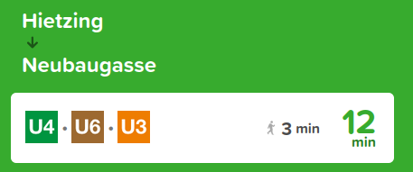
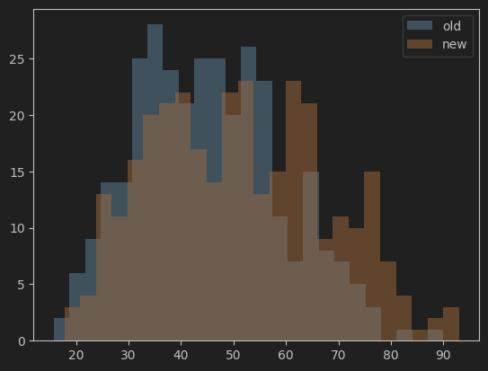
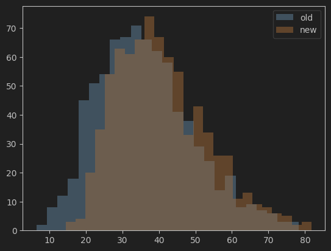

<h1 style="text-align: center;" align="center">Disrupture</h1>
<p style="text-align: center;" align="center">
	Knowledge Graphs VU 192.116, 2024S, 2.0h/3.0ECTS<br>
</p>

A generalized transit planner for Vienna. Given a list of scheduled disruptions (such as station/track segment maintenance), this program will determine the optimal order of maintenance to cause the overall least disruption combined. 

All station data was acquired from https://citymapper.com/

# Table of Contents

* [1. Introduction](#1-introduction)
	* [1.1. Problem](#11-problem)
	* [1.2. Solution](#12-solution)
	* [1.3. Motivation](#13-motivation)
* [2. Data](#2-data)
	* [2.1. Data Collection](#21-data-collection)
	* [2.2. Included Lines](#22-included-lines)
	* [2.3. Excluded Lines](#23-excluded-lines)
* [3. Methodology](#3-methodology)
	* [3.1. Fuzzy String Matching](#31-fuzzy-string-matching)
	* [3.2. Transit Graph](#32-transit-graph)
		* [3.2.1. `travel_times`](#321-travel_times)
		* [3.2.2. `wait_times`](#322-wait_times)
		* [3.2.3 `add_lines()`](#323-add_lines)
		* [3.2.4 `detect_line_type()`](#324-detect_line_type)
		* [3.2.5 `fastest_path()`](#325-fastest_path)
		* [3.2.6. `minimize_changes()`](#326-minimize_changes)
	* [3.3. Simulator](#33-simulator)
		* [3.3.1. `simulate_journeys()`](#331-simulate_journeys)
		* [3.3.2. `disrupt()`](#332-disrupt)
		* [3.3.3. `simulate_disruption()`](#333-simulate_disruption)
		* [3.3.4. `get_stats()`](#334-get_stats)
	* [3.4. Scheduler](#34-scheduler)
* [4. Results](#4-results)
	* [4.1. Transit Graph Routing](#41-transit-graph-routing)
	* [4.2. Simulation Statistics](#42-simulation-statistics)
	* [4.3. Maintenance Scheduling](#43-maintenance-scheduling)
* [5. Future Work](#5-future-work)
	* [5.1. Improved station name matching](#51-improved-station-name-matching)
	* [5.2. Longer contiguous segment disruptions](#52-longer-contiguous-segment-disruptions)
	* [5.3. Continuous updates](#53-continuous-updates)
	* [5.4. Dashboard](#54-dashboard)
	* [5.5. Walking](#55-walking)
	* [5.6. Physical location weighting](#56-physical-location-weighting)
	* [5.7. Graph Neural Network](#57-graph-neural-network)
* [6. Example Usage](#6-example-usage)
	* [6.1. Summary of Other Functions](#61-summary-of-other-functions)

# 1. Introduction

## 1.1. Problem

Disruptions are a commonplace among the transportation sector. Although some of these situations are from unexpected issues, some are required for reasons such as maintenance. Scheduling the multiple maintenance requirements of a system is a problem as old as man-made structures. In the context of transportation, an alternative route for a specific journey is usually automatically provided by navigation systems. However, the overall inconvenience caused is hard to grasp in the scope of an entire network. For example, if there are 5 stations that need to be closed at some point for maintenance, while only 2 stations need to be closed at the same time, how would this be planned?

## 1.2. Solution

Scheduling maintenance has become much easier in recent times due to the
advent of computer technologies. The quick calculation of different scenarios transformed the field of maintenance from simple timetable planning to comprehensive simulations with many constraints. This project involves the exploration using relatively simple statistical observations to schedule things. Assuming a set of specific station & segment closures, generalizations about its effects can be observed via the alternative routes of many simulated journeys. Many journeys with randomly generated end points can be measured before the disruption, then
by removing the station of interest the same journeys can be measured again. The planning of maintenance could thus be optimized by determining which combinations of closures have the least disruptive effects. The exact methodology of how these journeys are measured along with closure "effects" will be discussed further in the methodology

## 1.3. Motivation

I have always been interested in transportation. In more recent times, I have become especially interested in public rail networks. Vienna boasts a proper commuter & metro rail system, yet most impressively the 6th largest tram system in the world. Such a large interconnected network of trains gives much potential to studying it in a graph representation. I chose the route of the maintenance scheduling as the programmatic ways of approaching this issue has  only arisen recently, being actually applied by the industry in only recent years. This allows me to explore the basic components of a state-of-the-art field of research. Despite many proven methods already existing for even more advanced methods of maintenance (e.g. predictive maintenance), I went for the simpler proactive scheduled maintenance & to approach this project from a ground up method to get a deeper understanding of creating graph networks.

# 2. Data

## 2.1. Data Collection

In order to build the network each line along with their respective stations is needed, which is technically displayed by any routing software when asking from directions from one end station to the other. CityMapper was  chosen for its ability to produce a concise list. Google Maps unfortunately shows the times of arrival at each station in between, creating a hurdle for quick collection. Although this data could technically be used to get the times between all stations, the computational complexity associated with that was ultimately decided against being implemented. This could be changed in a future version. With the ability to quickly copy a list from CityMapper & fix some formatting issues, the entire dataset was manually extracted in about 1 hour total (not at once). The process was as follows:

1. Get the names of the end stations from the Vienna transit map
2. Input these end stations into CityMapper, choosing the route that utilizes the single desired line.
	1. Some tram lines take somewhat windy routes as the line is not designed to be entirely used at once, meaning that when the fastest route is calculated, the tram line does not show up or is not entirely utilized. For example, tram line 5 goes from *Westbahnhof* to *Praterstern*, making a half circle around the north of the city. Any routing app would suggest the much faster U3/U1 route for example. Fortunately, CityMapper has a “simple” option which shows routes with the least transfers. However, this option is only on mobile, so it was required that the journey be sent as a link to a laptop to be subsequently copied.
	1. Some tram lines are currently out of service during the time of this project (September 2024), making their paths not immediately accessible from routing apps. Notably during this project was the Wiedner Haupstraße route from *Kliebergasse* to *Karlsplatz* affecting lines 1, 62, & Badnerbahn. The station list for these missing portions were typed out manually.
3. Copy the list of intermediate stations into a .txt file named the respective line.
	1. Several tram lines have stations that are 1-way only. This was checked manually. For simplification of the project, all stations were assumed to be bi-directional.
	1. Tram line 44 has a counter-clockwise loop of 1-way stations on its western end. It was difficult to come up with a satisfying approximation for "squashing" this loop into a bi-directional line that stayed reasonably true to the actual operations. The end method was simply listing out the stations from the physical location west to east. Although this is not accurate of the real world service, without the simplification the graph would become much more complex & no other lines exhibit this property.
4. Fix the formatting.
	1. When getting directions for trams, stations usually have an S or a U appended to the station name of ease of access indicated S-Bahn or U-Bahn service respectively. For example, when getting directions for the S-Bahn or U-Bahn, _Westbahnhof_ would appear simple as "Westbahnhof", while tram lines would say "Westbahnhof S+U".
	1. In German, Straße is often abbreviated as "Str." while Gasse is often abbreviated as "G.". Surprisingly, this is not consistent even when getting directions for multiple lines at the same station. For consistency, all abbreviations were expanded into the full form.

## 2.2. Included Lines

The included lines are explicitly listed out here for convenience: 

* **Through Trams:** D, O
* **Tangential Trams:** 1, 2, 5, 6, 9, 10, 11, 18
* **Radial Trams:** 25, 26, 30, 31, 33, 37, 38, 40, 41, 42, 43, 44, 46, 49, 52, 60, 62, 71
* **Trolleys:** Badnerbahn
* **Metros:** U1, U2, U3, U4, U6
<<<<<<< HEAD
* **Commuter Lines:** S1, S2, S3, S4, S7, S40, S45, S50, S60, S80 (Lines S1-S4 along with other regional lines are often referred to as the _Stammstrecke_ or _Pink Line_)
=======
* **Commuter Lines:** S1, S2, S3, S4, S7, S40, S45, S50, S60, S80 (Lines S1-4 are often referred to as the _Stammstrecke_, however this term in the real world also includes regional lines REX1-3 & CJX9 which are not included as explained in the next section.)
>>>>>>> origin/master

## 2.3. Excluded Lines

In spite of my burning passion to make the network as thorough as possible, not all public transit lines were included. The reasoning of each exclusion is described below. 

* **Wiener Linien Buses:** Buses were excluded early on, as firstly buses typically have no real "stations" that need maintenance, & secondly when a stretch of road needs to be closed, bus lines can very easily be re-routed via heavily subsidized road networks. Vienna also has 103 daytime bus lines, which is currently unfeasible given the manual collection of data. 
* **Postbuses:** There are also some number of Postbus lines which have multiple stops within the Vienna central tariff zone, though no information was easily found on if central tariff zone tickets are valid for post bus. Additionally, no easy consolidated source of which Postbus lines seems to exist.
* **Lilis Welt:** Although the Liliputbahn & the Donauparkbahn are more of small scale tourist attractions for parks that are not meant to be used as proper transit, they were still considered since they are rail lines that run between multiple stations at regular intervals. They were ultimately excluded since they are not part of the central tariff zone & their station names do not align with the connecting transit lines. The addition of them would be very simple, as each of the 2 lines only has a few stations.
* **Lines to the Airport:** There are the VAL (Vienna Airport Lines) Buses & The CAT (City Airport Train) that count as transit, but these were not included as the airport is not in the central tariff zone, which disqualifies these lines since they have no other stops within Vienna.
* **Regional Trains:** The regional services (R, REX, CJX) were heavily considered, due to their extensive service within Vienna. The identification of the lines proved to be more difficult, as the ÖBB Nahverkehr Ostregion map is hard to read & understand which lines cover which segments. Along with the fact that all regional lines share the same stretches with S-Bahn lines though skipping some stations, they were ultimately not crucial aspects of the network. These lines however can easily be added.
* **Long Distance Trains:** These services (D, IC, EC, RJ, RJX, ICE, NJ, EN, RGJ, ICE, NT, GE, Westbahn) share many of the same difficulties as regional trains, except the information would be extremely difficult to accurately collect due to the numerous different operators.

# 3. Methodology

The project employs a pure Python approach for simplification, heavily utilizing the NetworkX library. The NetworkX library is often abbreviated as "nx" in code, so all future references to this library will also use such. In each class, only a few relevant methods will be explained. For further details on the implementation, all classes, functions, & attributes contain full docstrings in the code.

## 3.1. Fuzzy String Matching

As mentioned before, there were many issues with inconsistent naming schemes for stations. In order to handle this more efficiently, the file `FuzzyFunctions.py` was created. The function `detect_possible_duplicates()` takes all currently inputted stations & pass it as a list of strings. The function would then print all pairs of stations that could be duplicates. This was helpful in identifying duplicate stations.

Another issue encountered early on is that the code requires an exact name to manipulate a specific node or edge. It is easy to forget the exact spelling of a station in the system, so `find_possible_match()` in the same file was created. This takes in a single incorrect station name along with the same list of all stations to print out potential matches. This function proved useful to the point where it is also used in the main parts of the project.

## 3.2. Transit Graph

The 1st major class is in `TransitGraph.py`. This class represents the overall "Graph" used in the transit network, extending the `nx.Graph` class. The class `nx.MultiGraph` was also considered at first, but was abandoned since it did not implement the vital function `nx.shortest_simple_paths()`. The details of this are explained more in `fastest_path()` section.

### 3.2.1. `travel_times`

This is dictionary containing the average amount of times between each station for a given type of line. For simplicity, all lines were divided into 4 types (tram, trolley, metro, commuter). The raw numbers below were acquired by looking at several journeys on Google maps & taking an estimation.

| Type     | Time |
|----------|------|
| Tram     | 1.5  |
| Trolley  | 1.75 |
| Metro    | 2    |
| Commuter | 3    |

If different types of line go through the same segment (e.g. U4 & S40 both go from _Heiligenstadt_ to _Spittelau_), the shorter time is taken. Here is the explanation put above the relevant section of code:

" If the line is of a different type than the existing value, convert it to the type with the shortest travel time. This is based on the assumption that longer distance lines (such as commuter lines) accommodate the distances of shorter distance lines (such as metros) when going into more populated areas. Although this happens both ways, since this graph is designed around a transit system within a heavily populated city, it is more likely that a segment is built for shorter distance lines. Thus for ease of calculation, the shorter travel time is used for all lines in a segment. "

### 3.2.2. `wait_times`

Typical intervals of each line type during peak times. This assumes that all lines of a specific type have the same interval. These numbers were taken by looking at some time tables from Wiener Linien, Wiener Lokalbahnen, & ÖBB to make reasonable approximations.

| Type     | Time |
|----------|------|
| Tram     | 6    |
| Trolley  | 7.5  |
| Metro    | 3.5  |
| Commuter | 30   |

One exception to this is the S45, which has 10-minute intervals.

### 3.2.3 `add_lines()`

This primarily employs the built in function `Graph.add_edge()`, but with some caveats relating to a transit system. The Graph object only supports a single edge between 2 nodes, but with the edge attribute dictionary, any amount of information can be stored. In this case, any new lines to add on the same edge can simply be added to the attribute dictionary. Within the code, this corresponds to the attribute 'lines' being a set of line names as strings.

### 3.2.4 `detect_line_type()`

The type of line is used multiple times throughout the code, although storing this information everywhere its needed would be a lot of extra overhead along with the possibility of asynchronous updates. In order to streamline, this function automatically takes in the line name & returns its corresponding type. This is possible because every line has a very consistent naming scheme outside a few exceptions. 

### 3.2.5 `fastest_path()`

This method is where the majority of the code for this class sits. This employs the use of the built-in function `nx.shortest_simple_paths()`, although this only handles half of the path finding. This function only finds the fastest paths using a single edge attribute as the "weight", which means it cannot be used to account for transfer times. There is the possibility to pass a function in as the weight, which can read the information from multiple edge attributes, but in order to get the transfer times the entire route needs to already be set in order to determine which lines were used.

The solution to this was to generate some number of paths based only the travel times as the weight. The resulting path Then based on this information, the custom function minimize_changes() determines the optimal lines to use to accomplish this path. Once a list of possible lines is acquired, the penalty for transfers can be calculated. For any transfer, 1 minute is added. If the transfer is onto a different type (e.g. Metro to Commuter), another minute is added since usually these platforms for different services are far apart within the station. This again is a huge simplification from real world conditions. 

This overall is a heuristic solution that does not truly guarantee the fastest path, only the likely fastest path. Increasing the number of paths generated transfers (the default being 10), will increase the likelihood of finding the optimal path. 

### 3.2.6. `minimize_changes()`

This was created to take a list of possible lines serving each segment along a list of stations & return the list of lines that result in the least number of transfers. Out of the entire codebase this method was the most complex to write. The easiest way to understand this function is by seeing an example usage on imaginary data:

```python
from TransitGraph import TransitGraph
print(TransitGraph().minimize_changes([
	{'10', '60'},
	{'10', '60'},
	{'52', '60'},
	{'52', '60'},
	{'6', '18'},
	{'6', '18'},
	{'18'},
	{'18', '4'},
	{'18'},
	{'18', '1'},
	{'18', '1'},
	{'1'}
]))
```
`Output: [{'60'}, {'18'}, {'1'}]`

## 3.3. Simulator

The 2nd major class is the simulator. This uses the transit graph as an attribute & allows for easy simulation of many journeys to collect statistics. This is also where disruptions come in, as this allows the automatic deletion of specific stations or segments.

### 3.3.1. `simulate_journeys()`

Randomly generates a specified number of journeys out of all stations. The primary piece of information collected is the estimated time to make this journey in the default transit network (no disruptions)

### 3.3.2. `disrupt()`

Provides the ability to remove a station or segment from the graph. The following disruption types are allowed:

* The name of the station as a string. If a station is removed, all segments connected to that station are also removed.
* A list of 2 stations, indicating the segment to be removed. The stations themselves remain intact, although all lines on this segment are removed.
* A list of 2 stations along with a set of lines to remove. This allows not the entire segment to be disrupted, but only specific lines running between them. 

### 3.3.3. `simulate_disruption()`

Re-runs all journeys after a specific disruption has occurred. This function collects all the new journey times, from which specific statistical insights can be gained. It also optionally has the ability to print the journeys that are no longer possible


### 3.3.4. `get_stats()`

This collects several common statistics after a disruption has been simulated, mostly importantly the "score", which will be used to compare different disruptions. The formula used was 

$$c * 100 + d * m$$

* $c$ : The # of canceled journeys, meaning they are no longer possible given the disruption. Although it is arguable, a canceled journey was considered to be just as "bad" as a journey being doubled in time. This gives a raw score that can be used to compare disruptions.
* $d$ : The # of delayed journeys.
* $m$ : The mean of the delay, measured as the percentage of increase compared to the original journey time. This is because some journeys simply take longer than others, & without a form of normalization they would unnecessarily affect the score.

## 3.4. Scheduler

This function is the end culmination of the entire project. This takes a list of disruptions & the maximum allowed disruptions at once in to return a list indicating the recommended disruption order. This is representative of a real world situation, where multiple stations need to be closed but not all at once.

First, all combinations of disruptions are generated, depending on the number allowed at once. The number allowed at once is by default 2, as higher values along with more disruptions leads to an exponentially large list of combinations.

Next, for each pair, the disruption score is calculated. The brute force nature of the combinations means that this step can take quite a while depending on the configuration.

Then the pair with the lowest score is chosen first. The following pair is found with the next lowest score that also does not contain the same disruptions that the previous has. This continues until the amount of disruptions is lower than the number allowed at once.

Finally, this list is printed out at once to show a recommended closure order.

# 4. Results

The information available from these scripts can serve useful for analysis on the robustness of the transit network. In this section, functions with a useful output for a user are demonstrated. All results can also be found in `Results.ipynb`.

## 4.1. Transit Graph Routing

The transit graph can be used as a standalone direction giver. The results seem pretty close to proper routing services. It is impressive given that the program only uses static information with large simplifications in transit/wait times. The computation times are not included as the results are almost instant. Here a few examples of the program input/output, along with most similar CityMapper results:

```python
from TransitGraph import TransitGraph
TransitGraph().print_fastest_path(
	'Radetzkyplatz', 'Schloss Schönbrunn'
)
```

```
Lines used: [{'O'}, {'U4'}, {'10', '60'}]
Calculated travel time: 34.25
Stations: ['Radetzkyplatz', 'Hintere Zollamtsstraße', 'Marxergasse', 'Mitte-Landstraße', 'Stadtpark', 'Karlsplatz', 'Kettenbrückengasse', 'Pilgramgasse', 'Margaretengürtel', 'Längenfeldgasse', 'Meidling Hauptstraße', 'Schönbrunn', 'Hietzing', 'Schloss Schönbrunn']
```


```python
TransitGraph().print_fastest_path(
	'Handelskai', 'Westbahnstraße/Zieglergasse'
)
```

```
Lines used: [{'S2', 'S7', 'S1', 'S4', 'S3'}, {'U3'}, {'49'}]
Calculated travel time: 34.75
Stations: ['Handelskai', 'Traisengasse', 'Praterstern', 'Mitte-Landstraße', 'Stubentor', 'Stephansplatz', 'Herrengasse', 'Volkstheater', 'Stiftgasse', 'Siebensterngasse', 'Westbahnstraße/Neubaugasse', 'Westbahnstraße/Zieglergasse']
```


```python
TransitGraph().print_fastest_path('Hietzing', 'Neubaugasse')
```

```
Lines used: [{'U4'}, {'U6'}, {'U3'}]
Calculated travel time: 21.25
Stations: ['Hietzing', 'Schönbrunn', 'Meidling Hauptstraße', 'Längenfeldgasse', 'Gumpendorfer Straße', 'Westbahnhof', 'Zieglergasse', 'Neubaugasse']
```



## 4.2. Simulation Statistics

The simulation class can be used as a standalone statistics generator for disruptions, allowing some exploration into which stations are more or less important, or which cancel more journeys. In the example below, 2 histograms plot the journey times before & after a disruption. The x-axis represents the amount of time a journey took, while the y-axis is the amount of journeys that took that amount of time. 


```python
from Simulator import Simulator
sim = Simulator(10_000)
sim.disrupt('Meidling')
sim.plot_delay()
```



The simulation time was 2 minutes 7 seconds.

```python
sim = Simulator(10_000)
sim.disrupt('Schlachthausgasse')
sim.disrupt(['Schottentor', 'Rathausplatz/Burgtheater'])
sim.simulate_disruption()
sim.plot_delay()
```



```python
sim.get_stats()
```

The simulation time was 15 minutes 52 seconds, though my laptop started to thermal throttle around the 2nd half. The expected time based on the configuration would be about 5 minutes.

```
{
	'score': np.float64(16402.5026711263),
 	'journeys_delayed': 720,
 	'journeys_faster': 61,
 	'journeys_canceled': 43,
 	'journeys_total': 10000,
 	'delay_times': {
		'min': -16.5,
  		'median': np.float64(3.75),
  		'mean': np.float64(4.462400554868165),
  		'max': 28.5
	},
 	'delay_times_perc': {
		'min': -40.0,
  		'median': np.float64(9.523809523809518),
  		'mean': np.float64(16.80903148767542),
  		'max': 238.46153846153845
	}
}
```

As seen from the statistics, the average delay time was 4.5 minutes, while the average delay as a percent of the journey was 16.8%. Note here that a small number of journeys get faster due to this disruption. This is because of the heuristic path finding algorithm. Since the initial algorithm focuses on shortest number of segments only without considering the transfer time, removing certain elements of the graph can make it find journeys that have a longer transit time, but a shorter transfer time.

## 4.3. Maintenance Scheduling

As for the end goal of the project, maintenance scheduling results also seem promising. However, there is no baseline of what constitutes a "better" scheduling of disruptions. It can only be said that the calculations are based on reasonable assumptions, which have been explained so far in the text.

```python
from Scheduler import schedule_disruptions
schedule_disruptions([
	'Schwedenplatz', 'Schottenring', 
	'Parlament', 'Volkstheater', 
	'Handelskai'
])
```

```
Recommended closure order:
('Schwedenplatz', 'Schottenring')
('Parlament', 'Handelskai')
Volkstheater
```

The scheduling above took 28 seconds.

```python
schedule_disruptions([
	['Schwedenplatz', 'Schottenring'], 
	['Parlament', 'Volkstheater'], 
	'Handelskai', 
	'Radetzkyplatz',
	['Schottentor', 'Schwarzspanierstraße', {'40', '41', '42'}],
	['Währinger Straße-Volksoper', 'Spitalgasse'],
	['Zieglergasse', 'Neubaugasse'],
	['Karlsplatz', 'Resselgasse', {'1', '62'}],
	'Karlsplatz',
], journey_count=1_000)
```

```
Recommended closure order:
(['Schottentor', 'Schwarzspanierstraße', {'40', '41', '42'}], ['Karlsplatz', 'Resselgasse', {'62', '1'}])
(['Schwedenplatz', 'Schottenring'], ['Währinger Straße-Volksoper', 'Spitalgasse'])
(['Parlament', 'Volkstheater'], ['Zieglergasse', 'Neubaugasse'])
('Handelskai', 'Radetzkyplatz')
Karlsplatz
```

The scheduling above took 16 minutes 36 seconds

```python
schedule_disruptions([
	['Schwedenplatz', 'Schottenring'],
	['Parlament', 'Volkstheater'],
	'Handelskai',
	'Radetzkyplatz',
	['Schottentor', 'Schwarzspanierstraße', {'40', '41', '42'}],
	['Währinger Straße-Volksoper', 'Spitalgasse'],
	['Zieglergasse', 'Neubaugasse'],
	['Karlsplatz', 'Resselgasse', {'1', '62'}],
	'Karlsplatz',
], journey_count=10_000, paths_before_transfers=15)
```

```
Recommended closure order:
(['Schottentor', 'Schwarzspanierstraße', {'40', '42', '41'}], ['Karlsplatz', 'Resselgasse', {'62', '1'}])
(['Schwedenplatz', 'Schottenring'], ['Währinger Straße-Volksoper', 'Spitalgasse'])
(['Parlament', 'Volkstheater'], ['Zieglergasse', 'Neubaugasse'])
('Handelskai', 'Radetzkyplatz')
Karlsplatz
```

The scheduling above took 2 hours 46 minutes 45 seconds

As seen from the results, a more thorough simulation greatly increases the computation time. During development of this application, a simplified dataset of 3 lines & about 20 stations was used to make sure the program logic was correct. Also the top 5 journeys was used for fastest route calculation, & only 100 journeys for the simulation. For full testing, results of 10 paths & 1000 journeys can provide reasonable results while only needing about 30 minutes on my laptop. The brute-force nature is not very scalable in this context. If there were many stations that needed maintenance over a much larger network, this would not be feasible to use. On the bright side, results show that smaller parameters can produce the same results.

# 5. Future Work

There are multiple parts of this project that required simplifications from the real world, most in order to be computationally feasible. Along with removing these simplifications, there are other possible expansions to be considered, ordered from least to most complex.

## 5.1. Improved station name matching

As shown before, there is a simple string matching function in order to recommend possible stations when the input is not found. This function is mostly barebones & for many queries does not produce satisfying results. For example, although there is a U6 station called "Wahringer", putting this in will not return the full name "Währingerstraße-Volksoper". If this program is to be used by a wider audience, this would greatly improve the user-friendly aspect.

## 5.2. Longer contiguous segment disruptions

Currently, the only supported segment disruption is of 2 stations that are directly adjacent to each other. In reality, longer segments are disrupted along a particular line. This is technically possible already in the program, but it would be tedious to individually cancel every segment by manually specifying the station names.

Ideally an implementation would when specifying 2 stations, show all lines that connect these 2 stations without interruptions. The user would then be prompted to either cancel all or some of the lines.

## 5.3. Continuous updates

Updates to the database are relatively straightforward if needed to be done manually, as it is simply change the text file of the corresponding line. In a practical sense, this is unreasonable as changes can happen constantly & the resources required to update the graph manually would produce alot of overhead. Wiener Linien themselves provide an API for trains coming in at each station. This could be utilized so that the available networks would provide real-time routing, achieving a much higher level of accuracy. Although the API itself does not provide the stations in each line, the data could be extrapolated to determine which stations / segments are currently in service at a given moment.

## 5.4. Dashboard

If there was some kind of GUI, this program would be much more accessible to a wider audience. A pure text interface is unintuitive for many. A dashboard would also permit some extra features that would be too clunky to implement with text alone. Moreover, this would solve the issue of station name matching, as users could possibly select stations / segments that they wish to disrupt.

## 5.5. Walking

As seen in many real world routing applications, walking is a suitable alternative to stations that are physically nearby, but not actually connected by any transit line. For example, if a single segment is disrupted, the best solution is to often take the 5-10 minute between the 2 stations & continue the journey on the same line. It was considered to manually look up the few stations that are indicated as walkable by Wiener Linien (e.g. _Burgasse-Stadthalle_ to _Urban-Loritz-Platz_) & manually inserting that as a pretend line. In order for this to work, each walking path would be a separate text file, so it was decided against this.

Another possible implementation would be something more programmatic. Generating all walking distances is unfeasible, while generating walking distances for nearby stations requires knowing the physical location of each. A dataset which contains the coordinates for most stations was explored, but working with it for now would not help enough in the limited scope of the project.

## 5.6. Physical location weighting

Not all stations are equally important, regardless of their connectivity to other lines in the network. If some physical location of each station is implemented like mentioned before, it would also be possible to create a pseudo-heatmap of Vienna to add "weight" to more important stations. This could be done in a touristic sense (Stephansplatz), in a business sense (Kaisermühlen-VIC), or even prioritizing access to the river during hot days.

This could further be extended by storing locations of specific places of interest. In the tourism example, much data could be acquired online about tourists attractions in Vienna, with a lot of descriptions of these places carrying much semantic weight. An embedding could be used to store the similarity component of these attractions. Someone who is interested in visiting some museum would likely be interested in visiting other museums. When simulating journeys, it could be made so that ones that go between these related places are more likely to occur, since many journeys in real life are made between places relevant to that individual. This would create a more realistic simulation than simply randomly generated origin & target destinations.

Another way to build upon this idea is to plan journeys around a specific set of circumstances. A person could want to find a series of journeys that finds some balance between minimizing time & visiting relevant places. An example query would be "What journey would allow me to visit the most art museums, while visiting highly rated places for breakfast, lunch, & dinner". The implementation of this would only require physical location data & categories for these places, while utilizing the existing routing methods.

An important aspect of transportation is that connectivity drives the economy. A functioning city depends on peoples ability to access jobs from their place of residence. The high volumes during the rush hours are indicative of these commuting patterns. Most people making these journeys are going to work, then back home in the afternoon. If more data was available on these commuting patterns, then the disruption to the economy could also be taken into account when scheduling maintenance, in addition to the aforementioned physical location weighing of stations near business districts.

## 5.7. Graph Neural Network

Many aspects of my program are brute forced, such as the fastest routes or the scheduling combinations. A graph neural network could alleviate some of this complexity by providing more approximate solutions to computationally difficult problems.

For example, in the fastest route calculation, the algorithm for determining the fastest path via the travel times is exact, but in complete disregard to the transfer times added on. Finding the best route within the transfer time constraint is also unreasonable to be done exactly, yet the existing implementation does not converge to a ideal scenario. If a neural network could approximate both aspects of route planning, the end result would more likely be the best option.

The utility of neural networks does not end there. The previous ideas for expansion discussed earlier (related place journeys, commute patterns) would require an extensive rule based implementation for determining importance. If several scores for each of these aspects could create some embedding, then a neural network could make recommendations based on real time data (events, holidays, semester cycles) by observing historical trends without the need for the implications to be explicitly stated. For example, semester beginnings create more traffic around universities & student dormitories. Only the baseline information about locations is required before a model can predict the effects of future events. An aggregation of these ideas into an assistant dashboard would revolutionize transport planning. 

# 6. Example Usage

This program uses Python version 3.12

The primary function of this program is scheduling maintenance via `Scheduler.schedule_disruptions()`, which takes in a list of disruptions. Disruptions can be in the following format:
1. `'station'`
	* Removes a station, including all adjacent lines
2. `['origin', 'target']`
	* List containing the origin & target names of the desired track segment to be removed.
3. `['origin', 'target', {lines...}]`
	* Same as before, except with the optional 3rd element in the list being a set containing only specific lines to
	  remove from the segment.

Below is an example of the most basic usage, which assumes that only 2 stations can be closed at once. This can be modified via the argument `max_at_once`:

```python
from Scheduler import schedule_disruptions
schedule_disruptions(['Schwedenplatz', 'Schottenring', 'Parlament', 'Volkstheater', 'Handelskai'])
```
Output: 
```
Recommended closure order:
('Schwedenplatz', 'Schottenring')
('Parlament', 'Handelskai')
Volkstheater
```

To get familiarized with other stations in Vienna along with what lines serve them, take a look at `Vienna_trains.png`.

## 6.1. Summary of Other Functions

* Routing - via the class `TransitGraph`
	1. `print_fastest_path(origin, target)`
* Disruption stats - via the class `Simulator`
	1. `disrupt(disruption)`
		* This can be called multiple times to combine desired disruptions.
	2. `simulate_journeys(self)`
	3. `Simulator.get_stats()`
	4. `Simulator.plot_delay()`

More examples of using these functions are found in `Results.ipynb`

